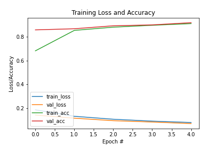

## Signature Verification using Siamese Network

### Prerequisites
* Python 3.6
* Tensorflow 2.5.0
* Keras 2.6.0

*Tested on Windows 10 - 64 bit*

---
### Dataset
* [CEDAR Signature](https://cedar.buffalo.edu/NIJ/data/).
* There are two folders:
    * full_forg: Contains 1320 forgery signatures (24 forgeries for each of 55 writers).
    * full_org: Contains 1320 genuine signatures (24 genuines for each of 55 writers).

---
### Evaluation

---
### Further Readings
Read these papers to have a clear scenario about Siamese Network and what I have implemented in this project.
* [Gregory Koch, Richard Zemel, and Ruslan Salakhutdinov. "Siamese Neural Networks for One-shot Image Recognition". In ICML, 2015.](https://www.cs.cmu.edu/~rsalakhu/papers/oneshot1.pdf)
* [Sounak Deya, Anjan Duttaa, J. Ignacio Toledoa, Suman K.Ghosha, Josep Llados, and Umapada Pal. "SigNet: Convolutional Siamese Network for Writer Independent Offline Signature Verification". In CVPR, 2017.](https://arxiv.org/abs/1707.02131)

---
### References
1. [hlamba28. Offline-Signature-Verification-using-Siamese-Network. GitHub.](https://github.com/hlamba28/Offline-Signature-Verification-using-Siamese-Network)
2. [Aftaab99. Offline Writer Independent signature verification. GitHub.](https://github.com/Aftaab99/OfflineSignatureVerification)
3. [Mehdi (2021). Image similarity estimation using a Siamese Network with a contrastive loss. Keras.](https://keras.io/examples/vision/siamese_contrastive/)